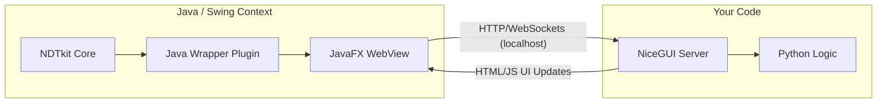

# NDTkit Python Plugin Template (NiceGUI + JavaFX)

## 📖 Overview

This repository is a **starter template** designed to create graphical plugins for **NDTkit** using **100% pure Python**.

It solves a common challenge: creating modern, interactive User Interfaces for NDTkit (which is Java-based) without writing a single line of Java code.

**The Magic behind this template:**

1. You write your UI logic in Python using **NiceGUI**.
2. This template wraps your Python code inside a pre-configured **Java container**.
3. NDTkit loads the plugin and renders your Python UI inside an embedded **JavaFX WebView** component.

> You code in Python, and it magically appears as a native window inside NDTkit. 🚀

-----

## 🏗 Architecture

This template acts as a bridge between the Java world of NDTkit and the Python world.



1. **The Java Wrapper:** A generic Java class (included in this template) starts your Python script as a background subprocess.
2. **The Server:** Your Python script starts a local NiceGUI web server.
3. **The UI:** The Java wrapper instantiates a **JavaFX WebView**, points it to the local Python server, and displays the result within the NDTkit interface.

-----

## ✨ Features

* **Zero Java Required:** The Java encapsulation is handled entirely by the template. You only focus on `src/main.py`.
* **Modern UI:** Leverage the power of **NiceGUI** (Material Design, Vue.js based) instead of Swing or AWT.
* **Seamless Integration:** Your plugin appears as a standard dockable panel or window within NDTkit.
* **Two-Way Communication:** (Optional) The template includes helpers to communicate between the Python backend and the NDTkit Java context (via sockets or standard I/O).

-----

## 📂 Project Structure

```text
python-plugin/
├── src/main/
│   ├── java/                                                # Pre-compiled Java code (Don't touch unless necessary)
│   └── resources/com/testia/ndtkit/plugin/pythonplugin/python-source-code      # <--- YOUR CODE GOES HERE (The Python NiceGUI App)
├── build-for-external.gradle  # Add this file if you're an external company 
└── build.gradle               # Script to package the plugin
```

-----

## 🚀 Getting Started

### Prerequisites

* Python 3.10+
* NDTkit 4.x installed
* Maven (only if you intend to modify the Java wrapper itself)

### 1\. Installation

Clone this repository to start your new plugin:

```bash
git clone https://<YOUR_REPO>/python-plugin.git python-plugin
cd python-plugin/resources/com/testia/ndtkit/plugin/pythonplugin/python-source-code
pip install -r requirements.txt
```

### 2\. Development

Open `python-plugin/resources/com/testia/ndtkit/plugin/pythonplugin/python-source-code/main.py`. This is where you define your interface.

```python
from nicegui import ui

# Simple Example
def on_click():
    ui.notify('Hello from Python inside NDTkit!')

ui.label('My Custom NDT Plugin').classes('text-2xl')
ui.button('Click Me', on_click=on_click)

# The template handles the ui.run() arguments automatically
if __name__ in {"__main__", "__mp_main__"}:
    ui.run(native=False, port=8080)
```

### 3\. Build & Deploy

## How to build

Just use Gradle to build the project

**Prerequisite if you're not a TESTIA's developer/subcontractors**

- Create a file called `build-for-external.gradle` at the root of this project. Copy the content of `example.build-for-external.gradle` within it.
- Edit the first line of `build-for-external.gradle` by referring the path through the NDTkit installation folder
- Rebuild the project using Gradle
- You should have a DEV license of NDTkit in order to test this plugin. If you don't have such a license, please contact support.ndtkit@testia.com.

## How to deploy

Launch the Gradle task build -> jar

This command allow to deploy the jar file of the plugin directly in the right folder so that NDTkit will recognize it. This action must done just once for creating a panel on the right in NDTkit which will display, in a web view, the web content created with the Python's NiceGUI library.

Then you can launch NDTkit and you're plugin will be available in the software
-----

## ❓ FAQ

**Q: Do I need to install JavaFX?**
A: No, NDTkit usually bundles the necessary JavaFX runtime. This template assumes the environment is provided by the host application.

**Q: Can I access NDTkit data (C-Scans) from my Python code?**
A: Yes. Since your Python code runs locally, you can use the standard `ndtkit-api` library (via Sockets) to fetch and manipulate data from the running NDTkit instance.

**Q: Is it slow?**
A: NiceGUI is highly optimized. The overhead of the JavaFX WebView is minimal. It feels like a native application.

## 📄 License

MIT License. Feel free to use this template for commercial or personal NDTkit plugins.